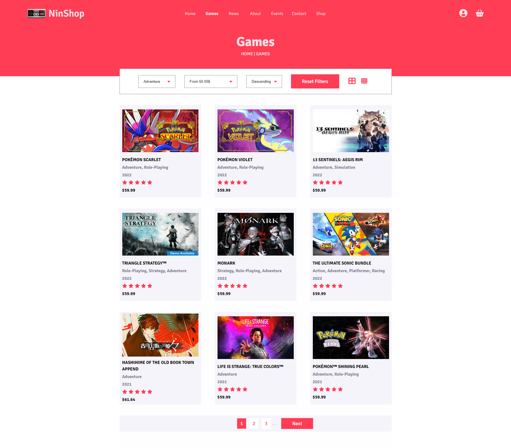

# NinShop

[](https://app.netlify.com/sites/ninshop-demo/deploys)

App web para mostrar juegos de Nintendo.

Los datos son obtenidos desde una API desarrollada para este proyecto, puede ver el código aquí: [https://github.com/EdixonAlberto/api-ninshop](https://github.com/EdixonAlberto/api-ninshop)

> **NOTA:** La url mostrada en este repositorio solo muestra una demo de la aplicación, la cual usa datos estáticos provenientes del siguiente archivo: [public/mocks/games.json](./public/mocks/games.json)



### Comandos
```sh
# Iniciar proyecto en modo desarrollo
yarn dev

# Compilar proyecto para producción
yarn build

# Iniciar servidor local para previsualizar la app
yarn preview

# Formatear todo el código contenido en /src usando prettier
yarn format
```

### Tecnologías Usadas

- React
- TypeScript
- Vite
- Redux Toolkit
- PostCSS
- CSS Nesting
- Yarn
